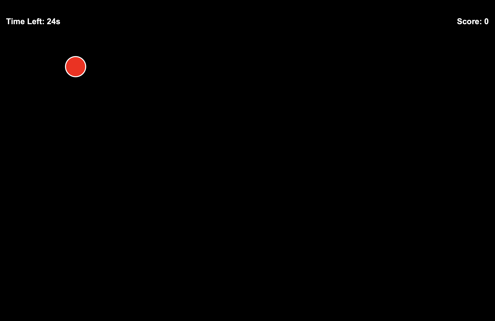
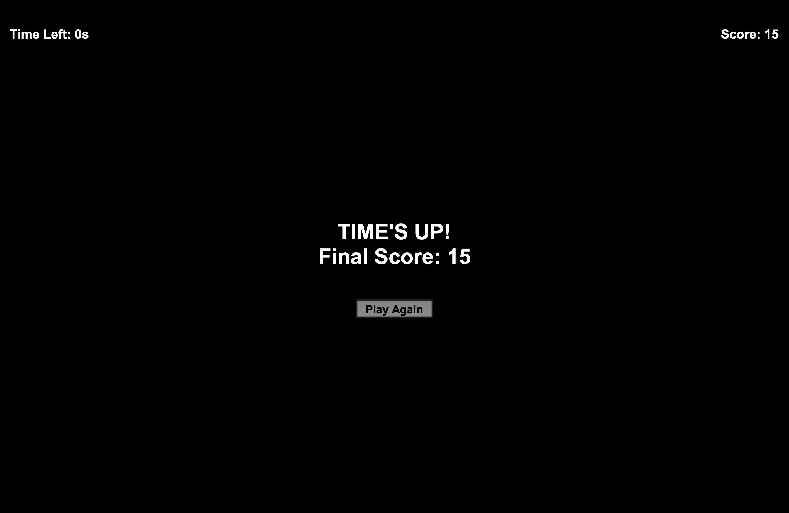

# Aim Tracker Pro

A simple desktop aim-tracking game built from scratch using Python and Tkinter.

## Overview

Aim Tracker Pro is a small reaction and mouse-accuracy game developed as a learning project. The goal is to click randomly positioned moving targets as many times as possible within a 30-second round.

The project focuses on practicing Python fundamentals, object-oriented structure, GUI programming, event handling, timers, and basic game logic.

## Features

- 30-second gameplay timer
- Random target generation
- Moving target
- Mouse-based hit detection
- Real-time score tracking
- Simple restart functionality
- Fullscreen support
- Minimal graphical interface

## Screenshots

### Gameplay



### Game Over



## Technologies Used

- Python
- Tkinter
- Git & GitHub

## How to Run
- Copy and paste it into any IDE and press F5

### Requirements

- Python 3.x
- Tkinter

### Run the game

```bash
git clone https://github.com/ASHEETO/Aim-Tracker-Pro.git
cd Aim-Tracker-Pro
python3 aim_tracker.py
```

## Controls

- **Left Mouse Button:** Hit the target
- **F11:** Toggle fullscreen
- **Esc:** Exit fullscreen

## Project Structure

```text
Aim-Tracker-Pro/
├── aim_tracker.py
├── README.md
├── LICENSE
└── .gitignore
```

## Learning Goals

This project was created to practice:

- Python programming
- Classes and object-oriented structure
- Tkinter GUI development
- Mouse event handling
- Timers and scheduled callbacks
- Randomization
- Basic game-state management

## Future Improvements

The project is intentionally kept simple. Possible future improvements may include:

- Accuracy statistics
- High-score tracking
- Adjustable target size
- Difficulty settings

## Author

**Arshit Dwivedi**

B.Tech Computer Science & Engineering  
ABES Engineering College, Ghaziabad
